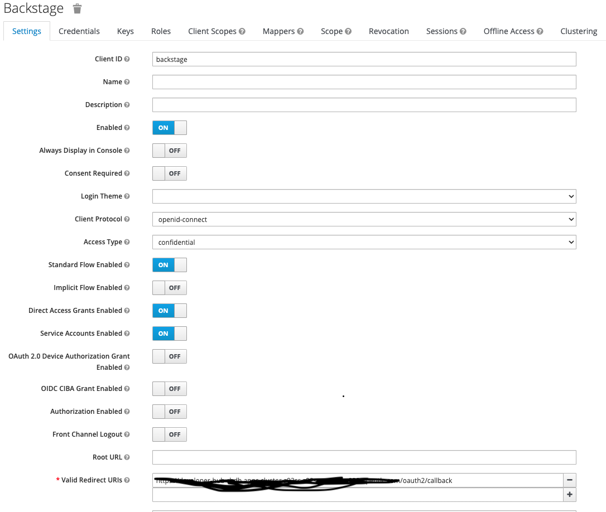
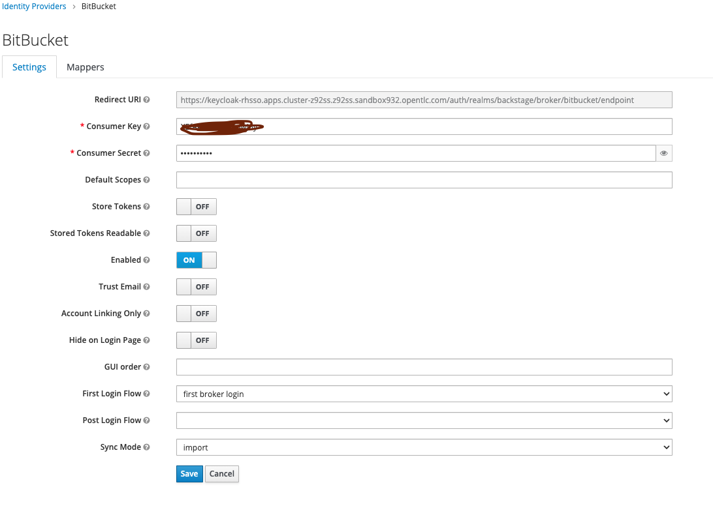
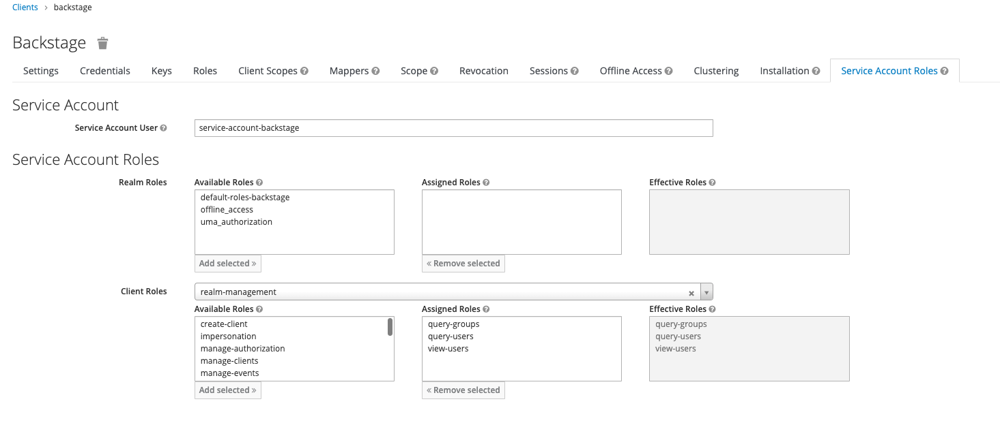
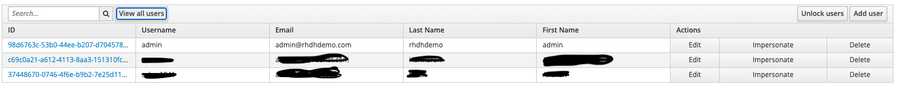

# RHDH - Bitbucket Authentication 

Backstage provides an authentication provider (https://backstage.io/docs/auth/bitbucket/provider) for bitbucket authentication which can be directly configured with app-config.yaml but it will result in ```User not found ``` error as the user entity is not getting created by this.

The workaround is to use Oauth2Proxy -> KeyCloak to federate this as OIDC provider with identity provider as Bitbucket.


## Bitbucket settings

Setup OAUTH Consumer for Key Cloak. open URL : https://bitbucket.org/< Org name >/workspace/settings/api


Create an Oauth Consumer set the following

1) Callback URL : <<KeyCloak_Route_URL>>/auth/realms/< realmname >/broker/bitbucket/endpoint
2) Under Permissions enable Account Email,Read checkbox.


## KeyCloak

Install the RHSSO operator on Openshift Once the Operator is installed create a key cloak instance, realm , client

```
  oc apply -f ./KeyCloak/KeyCloak.yaml
```

### KeyCloak Realm/client config

Replace the clientid and client secret in the file `KeyCloakRealm.yaml` before creating the realm

```
   oc apply -f ./KeyCloak/KeyCloakRealm.yaml
```

Create KeyCloak Client

Replace the `<<Developer-HUB-Route>>` in KeyCloakClient.yaml file before executing this.

```
   oc apply -f ./KeyCloak/KeyCloakClient.yaml
```

### Some Keycloak Screen shots to verify config.




# Oauth2-proxy config

## Prerequisite:

Create a secret named `keycloak-client-secret-rhdh` refer `./RHDH/keycloak-client-secret-rhdh.yaml` replace all the values. This secret is referred by Oauth2-proxy container and RHDH container

## Oauth2 container config 

>[!NOTE]
>Please refer ./RHDH/rhdh-helm-values.yaml for these changes

In order to add Oauth2-proxy to developer hub while installing helm charts add the followin to values.yaml `extraContainers` replace `<<KeyCloakroute>>` below with Keycloak route before adding this to values.yaml

``` 
  extraContainers:
      - args:
          - '--provider=oidc'
          - '--email-domain=*'
          - '--upstream=http://localhost:7007'
          - '--http-address=0.0.0.0:4180'
          - '--skip-provider-button'
          - '--insecure-oidc-allow-unverified-email=true'
        env:
          - name: OAUTH2_PROXY_CLIENT_ID
            valueFrom:
              secretKeyRef:
                key: KEYCLOAK_CLIENT_ID
                name: keycloak-client-secret-rhdh
          - name: OAUTH2_PROXY_CLIENT_SECRET
            valueFrom:
              secretKeyRef:
                key: KEYCLOAK_CLIENT_SECRET
                name: keycloak-client-secret-rhdh
          - name: OAUTH2_PROXY_COOKIE_SECRET
            value: '{{ randAlpha 32 | lower | b64enc }}'
          - name: OAUTH2_PROXY_OIDC_ISSUER_URL
            value: >-
              <<KeyCloakroute>>/auth/realms/backstage
          - name: OAUTH2_PROXY_SSL_INSECURE_SKIP_VERIFY
            value: 'true'
        image: 'quay.io/oauth2-proxy/oauth2-proxy:latest'
        imagePullPolicy: IfNotPresent
        name: oauth2-proxy
        ports:
          - containerPort: 4180
            name: oauth2-proxy
            protocol: TCP
```            

### Service changes to point to Oauth-proxy for developer hub

RHDH Service needs to point to Oauth2-proxy instead of developer hub container In Order to acheieve this update the following in values.yaml of RHDH helm chart.

>[!NOTE]
>Please refer ./RHDH/rhdh-helm-values.yaml for these changes

```
service:
    externalTrafficPolicy: Cluster
    ports:
      backend: 4180
      name: http-backend
      targetPort: oauth2-proxy
    sessionAffinity: None
    type: ClusterIP
```    

### Configure auth with OIDC

 Add the following to app-config yaml for authentication

 >[!NOTE]
  >Please refer ./RHDH/app-config.yaml for these changes

  ```
        auth:
            environment: development
            providers:
                oauth2Proxy: {}
    
        signInPage: oauth2Proxy
  ```

# KeyCloak Users/Group Sync

  ## Enabling Keycloak plugin

  KeyCloak Plugin needs to be enabled for RHDH to sync users/groups to RHDH User Entity. To enable KeyCloak Plugin add the following in values.yaml of helm chart

  >[!NOTE]
  >Please refer ./RHDH/app-config.yaml for these changes

  ```
  dynamic:
    includes:
      - dynamic-plugins.default.yaml
    plugins:
      - disabled: false
        package: >-
          ./dynamic-plugins/dist/janus-idp-backstage-plugin-keycloak-backend-dynamic
  ```

  ## Setup User Sync     
  
  Add the following config to RHDH app config.yaml

  >[!NOTE]
  >Please refer ./RHDH/app-config.yaml for these changes

  ```
    catalog:
        providers:
            keycloakOrg:
                default:
                    baseUrl: ${KEYCLOAK_BASE_URL}
                    realm: ${KEYCLOAK_REALM}
                    loginRealm: ${KEYCLOAK_REALM}
                    clientId: ${KEYCLOAK_CLIENT_ID}
                    clientSecret: ${KEYCLOAK_CLIENT_SECRET}
                    userQuerySize: 250
                    groupQuerySize: 250
                    schedule: # optional; same options as in TaskScheduleDefinition
                    # supports cron, ISO duration, "human duration" as used in code
                    frequency: { minutes: 1 }
                    # supports ISO duration, "human duration" as used in code
                    timeout: { minutes: 1 }
                    initialDelay: { seconds: 15 }
    rules:
        - allow: [Component, Group, User, Resource, Location, Template]
  ```   

  ## Screenshots to see service account client role mapping and user list

   ### KeyCloak
  
  

   ### RHDH
  