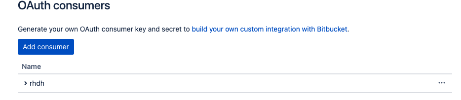
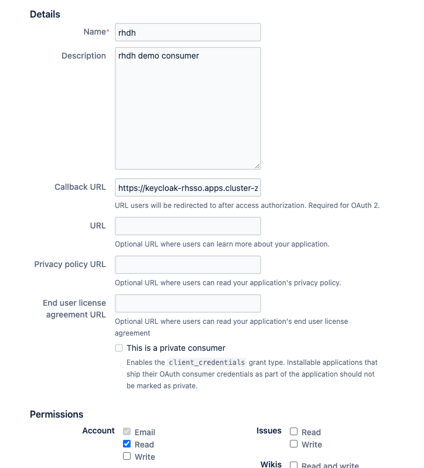

# RHDH - Bitbucket Authentication 

Backstage provides an authentication provider (https://backstage.io/docs/auth/bitbucket/provider) for bitbucket authentication which can be directly configured with app-config.yaml but it will result in ```User not found ``` error as the user entity is not getting created by this.

The workaround is to use Oauth2Proxy -> KeyCloak to federate this as OIDC provider with identity provider as Bitbucket.


## Bitbucket settings

Setup OAUTH Consumer for Key Cloak. open URL : https://bitbucket.org/< Org name >/workspace/settings/api



Create an Oauth Consumer set the following

1) Callback URL : <<KeyCloak_Route_URL>>/auth/realms/<<realmname>>/broker/bitbucket/endpoint
2) Under Permissions enable Account Email,Read checkbox.




## KeyCloak

Install the RHSSO operator on Openshift Once the Operator is installed create a key cloak instance, realm , client

```
  oc apply -f ./KeyCloak/KeyCloak.yaml
```

### KeyCloak Realm/client config

Replace the clientid and client secret in the file `KeyCloakRealm.yaml` before creating the realm

```
   oc apply -f ./KeyCloak/KeyCloakRealm.yaml
```

Create KeyCloak Client

```
   oc apply -f ./KeyCloak/KeyCloakClient.yaml
```

# Oauth2-proxy config

Prerequesite:

Create a secret named `keycloak-client-secret-rhdh` refer `./RHDH/keycloak-client-secret-rhdh.yaml` replace all the values. This secret is referred by Oauth2-proxy container and RHDH container

In order to add Oauth2-proxy to developer hub while installing helm charts add the followin to values.yaml `extraContainers` replace `<<KeyCloakroute>>` below with Keycloak route before adding this to values.yaml

``` 
  extraContainers:
      - args:
          - '--provider=oidc'
          - '--email-domain=*'
          - '--upstream=http://localhost:7007'
          - '--http-address=0.0.0.0:4180'
          - '--skip-provider-button'
          - '--insecure-oidc-allow-unverified-email=true'
        env:
          - name: OAUTH2_PROXY_CLIENT_ID
            valueFrom:
              secretKeyRef:
                key: KEYCLOAK_CLIENT_ID
                name: keycloak-client-secret-rhdh
          - name: OAUTH2_PROXY_CLIENT_SECRET
            valueFrom:
              secretKeyRef:
                key: KEYCLOAK_CLIENT_SECRET
                name: keycloak-client-secret-rhdh
          - name: OAUTH2_PROXY_COOKIE_SECRET
            value: '{{ randAlpha 32 | lower | b64enc }}'
          - name: OAUTH2_PROXY_OIDC_ISSUER_URL
            value: >-
              <<KeyCloakroute>>/auth/realms/backstage
          - name: OAUTH2_PROXY_SSL_INSECURE_SKIP_VERIFY
            value: 'true'
        image: 'quay.io/oauth2-proxy/oauth2-proxy:latest'
        imagePullPolicy: IfNotPresent
        name: oauth2-proxy
        ports:
          - containerPort: 4180
            name: oauth2-proxy
            protocol: TCP
```            

### Service changes to point to Oauth-proxy for developer hub

RHDH Service needs to point to Oauth2-proxy instead of developer hub container In Order to acheieve this update the following in values.yaml of RHDH helm chart.

```
service:
    externalTrafficPolicy: Cluster
    ports:
      backend: 4180
      name: http-backend
      targetPort: oauth2-proxy
    sessionAffinity: None
    type: ClusterIP
```    